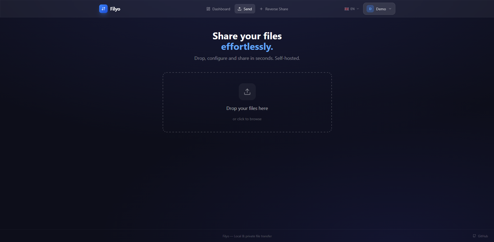
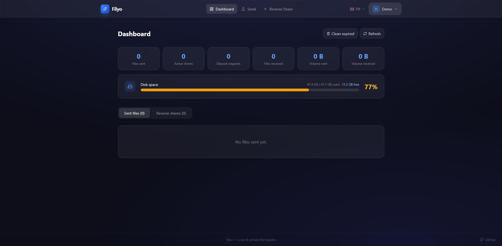
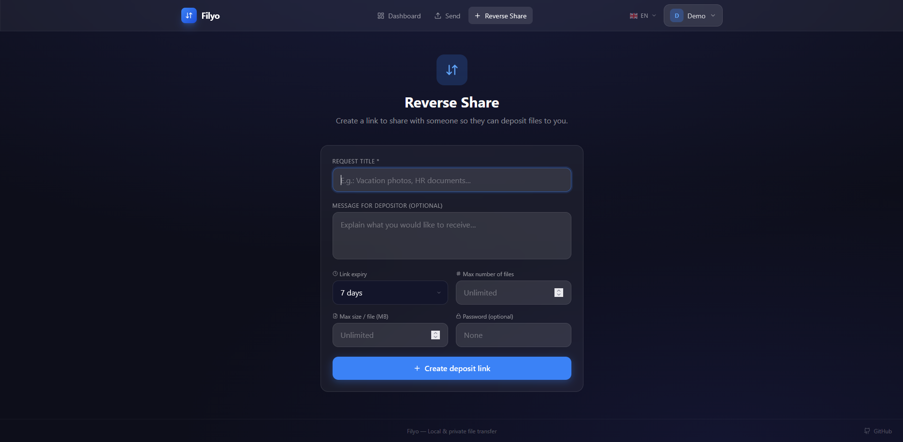
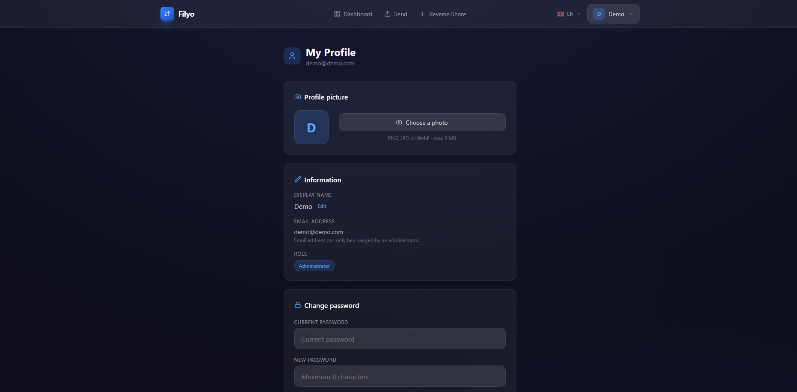

# Filyo — Transfert de fichiers local & privé

Application de partage de fichiers **auto-hébergée**, sans stockage S3. Alternative à Palmr avec un design glassmorphism sombre et une fonctionnalité de **partage inversé**.

## Captures d'écran

| Page d'envoi | Tableau de bord |
|:---:|:---:|
|  |  |

| Partage inversé | Profil utilisateur |
|:---:|:---:|
|  |  |

## Fonctionnalités

| Fonctionnalité | Description |
|---|---|
| **Envoi de fichiers** | Upload multi-fichiers avec barre de progression et glisser-déposer |
| **Protection** | Mot de passe optionnel par fichier/lien |
| **Expiration** | 1h / 24h / 7j / 30j / jamais |
| **Max téléchargements** | Limite configurable par lien |
| **Partage inversé** | Créer un lien pour recevoir des fichiers d'un tiers |
| **Info déposant** | Nom, email, message joint au dépôt |
| **Dashboard** | Statistiques, fichiers envoyés & reçus, demandes de dépôt |
| **Multi-utilisateurs** | Rôles Administrateur / Utilisateur, gestion depuis le panneau admin |
| **Inscription libre** | Activation optionnelle de l'inscription publique depuis les réglages |
| **Profil** | Avatar, nom affiché, changement de mot de passe |
| **Réglages** | Nom de l'app, logo, SMTP, inscription, apparence |
| **Thèmes** | Sombre / Clair / Automatique avec couleurs d'accent personnalisables |
| **Docker** | Images multi-arch (amd64 + arm64) |

## Lancement rapide

```bash
# 1. Copier la config
cp .env.example .env

# 2. Créer le dossier de données
mkdir -p ./data

# 3. Lancer avec docker-compose
docker compose up -d
```

L'application est disponible sur `http://localhost:3001`.

Au premier lancement, créez votre compte administrateur directement depuis la page de connexion.

## Derrière un reverse proxy (Traefik, Nginx…)

Filyo utilise des chemins relatifs pour l'API (`/api/…`), ce qui le rend compatible sans configuration particulière derrière un reverse proxy.

Exemple avec **Traefik** :

```yaml
labels:
  - "traefik.enable=true"
  - "traefik.http.routers.filyo.rule=Host(`filyo.mondomaine.fr`)"
  - "traefik.http.services.filyo.loadbalancer.server.port=3001"
```

> Pensez à configurer l'**Adresse du site** dans Réglages → SMTP pour que les liens de partage par email soient corrects.

## Architecture

```
filyo/
├── backend/         # Node.js + Fastify + Prisma + SQLite
│   ├── src/
│   │   ├── index.ts
│   │   ├── lib/prisma.ts
│   │   └── routes/
│   │       ├── auth.ts           # Authentification & profil
│   │       ├── files.ts          # Upload/download fichiers
│   │       ├── shares.ts         # Liens de partage
│   │       ├── uploadRequests.ts # Partage inversé
│   │       ├── users.ts          # Gestion utilisateurs (admin)
│   │       ├── settings.ts       # Réglages application
│   │       └── admin.ts          # Stats & cleanup
│   └── prisma/schema.prisma
│
├── frontend/        # React + TypeScript + Vite + Tailwind CSS
│   └── src/
│       ├── pages/
│       │   ├── HomePage.tsx          # Envoi de fichiers (drag & drop)
│       │   ├── DashboardPage.tsx     # Tableau de bord
│       │   ├── CreateRequestPage.tsx # Créer un lien de dépôt inversé
│       │   ├── RequestUploadPage.tsx # Dépôt via lien inversé (public)
│       │   ├── SharePage.tsx         # Téléchargement (lien public)
│       │   ├── ProfilePage.tsx       # Profil utilisateur
│       │   ├── SettingsPage.tsx      # Réglages (admin)
│       │   ├── UsersPage.tsx         # Administration (admin)
│       │   └── LoginPage.tsx         # Connexion / Inscription
│       └── api/client.ts
│
├── docs/screenshots/              # Captures d'écran
├── .github/workflows/docker.yml   # CI/CD → GHCR
├── docker-compose.yml
└── preview.html
```

## Partage inversé

1. Allez sur **"Partage inversé"** → configurez titre, message, expiration, limite de fichiers
2. Partagez le lien `/r/<token>` avec votre contact
3. Il dépose ses fichiers (avec son nom, email, message optionnel)
4. Vous les retrouvez dans le **Dashboard** → onglet "Partages inversés"

## Variables d'environnement

| Variable | Défaut | Description |
|---|---|---|
| `DATA_PATH` | `./data` | Dossier données hôte |
| `LOG_LEVEL` | `info` | Niveau de log (`silent`, `error`, `warn`, `info`, `debug`) |
| `JWT_SECRET` | *(généré)* | Clé secrète JWT — à changer en production |


## CI/CD — GitHub Actions

Le workflow `.github/workflows/docker.yml` :
- **Lint + type-check** sur chaque push/PR
- **Build multi-arch** (amd64 + arm64) et push sur `ghcr.io`
- Tags automatiques : `latest`, `sha-xxxx`, et versions sémantiques (`v1.2.3`)
- **Release GitHub** avec `docker-compose.release.yml` joint en artifact sur chaque tag `v*`

```bash
# Utiliser une image de release spécifique
IMAGE_TAG=v1.0.0 docker compose up -d
```
