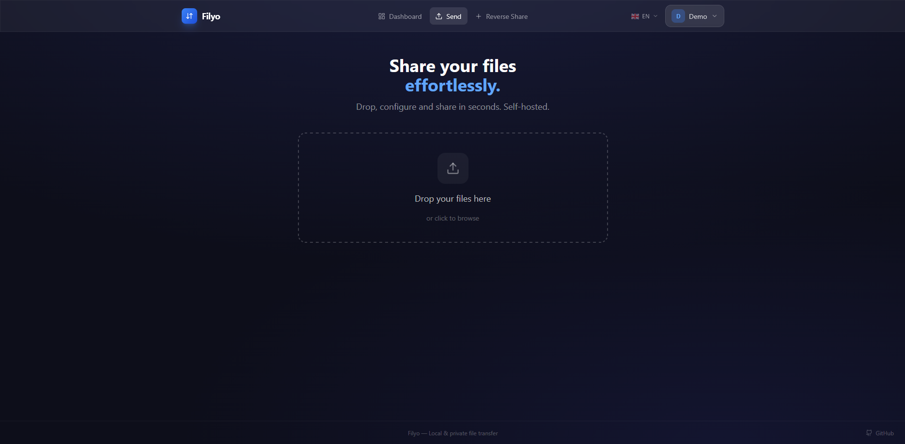
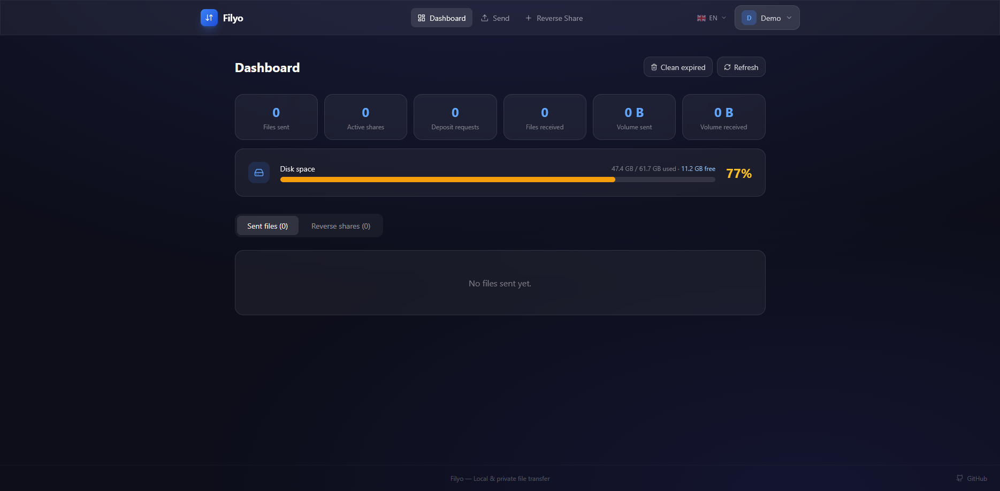
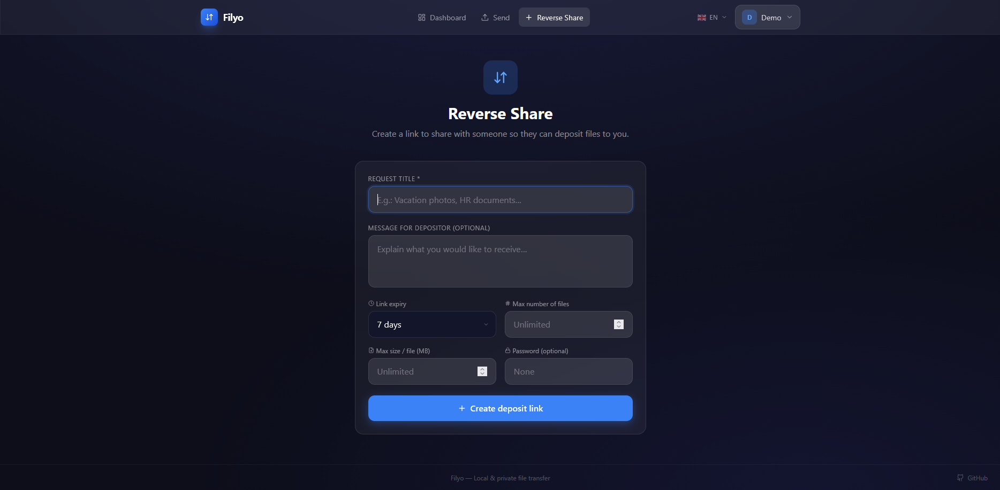
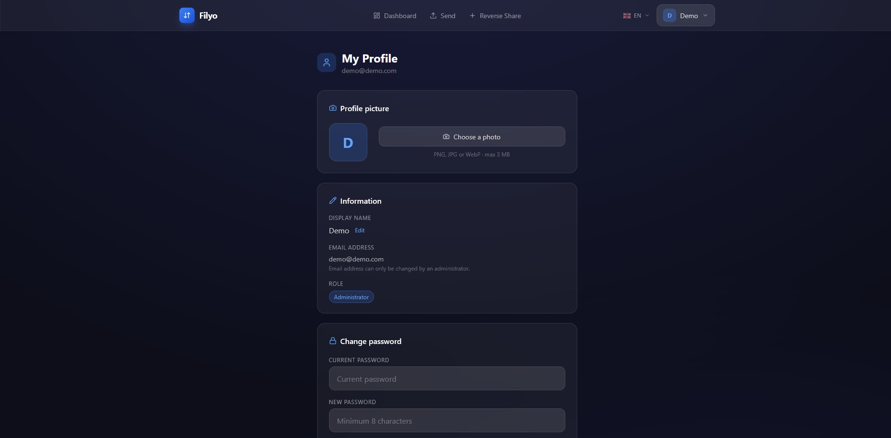

# Filyo — Transfert de fichiers local & privé

include_prereleases

Application de partage de fichiers **auto-hébergée**, sans stockage S3. Design glassmorphism sombre, interface bilingue (FR/EN), et fonctionnalité de **partage inversé**.

---

## Captures d'écran

| Page d'envoi | Tableau de bord |
|:---:|:---:|
|  |  |

| Partage inversé | Profil utilisateur |
|:---:|:---:|
|  |  |

---

## Fonctionnalités

| Fonctionnalité | Description |
|---|---|
| **Envoi de fichiers** | Upload multi-fichiers avec barre de progression et glisser-déposer |
| **Protection** | Mot de passe optionnel par fichier/lien |
| **Expiration** | 1h / 24h / 7j / 30j / jamais |
| **Max téléchargements** | Limite configurable par lien |
| **Envoi par email** | Envoi du lien de partage par email |
| **Partage inversé** | Créer un lien pour recevoir des fichiers d'un tiers |
| **Email partage inversé** | Envoi du lien de dépôt par email à un ou plusieurs destinataires (adresses séparées par des virgules) |
| **Info déposant** | Nom, email, message joint au dépôt |
| **Dashboard** | Statistiques, fichiers envoyés & reçus, demandes de dépôt (groupes repliés par défaut) |
| **Multi-utilisateurs** | Rôles Administrateur / Utilisateur, gestion depuis le panneau admin |
| **Inscription libre** | Activation optionnelle de l'inscription publique depuis les réglages |
| **Profil** | Avatar, nom affiché, changement de mot de passe |
| **Réglages** | Nom de l'app, logo, SMTP, inscription, apparence |
| **Thèmes** | Sombre / Clair / Automatique avec couleurs d'accent personnalisables |
| **i18n** | Interface entièrement traduite en français et anglais |
| **Docker** | Images multi-arch (amd64 + arm64), variantes SQLite et MariaDB |

---

## Lancement rapide

### SQLite (défaut — recommandé)

Aucune dépendance externe, la base de données est un simple fichier dans /data.

\`\`\`bash
cp .env.example .env
docker compose up -d
\`\`\`

### MariaDB

Pour les installations avec plusieurs utilisateurs simultanés ou en environnement de production chargé.

\`\`\`bash
cp .env.example .env
docker compose -f docker-compose.mariadb.yml up -d
\`\`\`

L'application est disponible sur http://localhost:3001.

Au premier lancement, créez votre compte administrateur directement depuis la page de connexion.

---

## Derrière un reverse proxy (Traefik, Nginx…)

Filyo utilise des chemins relatifs pour l'API (/api/…), ce qui le rend compatible sans configuration particulière derrière un reverse proxy.

Exemple avec **Traefik** :

\`\`\`yaml
labels:
  - "traefik.enable=true"
  - "traefik.http.routers.filyo.rule=Host(\`filyo.mondomaine.fr\`)"
  - "traefik.http.services.filyo.loadbalancer.server.port=3001"
\`\`\`

> Pensez à configurer l'**Adresse du site** dans Réglages → SMTP pour que les liens de partage par email soient corrects.

---

## Partage inversé

1. Allez sur **"Partage inversé"** → configurez titre, message, expiration, limite de fichiers
2. Copiez le lien /r/<token> ou envoyez-le directement par email à un ou plusieurs destinataires
3. Le destinataire dépose ses fichiers (avec son nom, email, message optionnel)
4. Vous les retrouvez dans le **Dashboard** → onglet "Partages inversés"

---

## Variables d'environnement

### Communes (SQLite & MariaDB)

| Variable | Défaut | Description |
|---|---|---|
| JWT_SECRET | *(requis en prod)* | Clé secrète JWT — **à changer absolument en production** |
| LOG_LEVEL | info | Niveau de log (silent, error, warn, info, debug) |
| PORT | 3001 | Port d'écoute du serveur |
| DATA_PATH | ./data | Dossier données sur l'hôte |

### SQLite uniquement

| Variable | Défaut | Description |
|---|---|---|
| DATABASE_URL | file:/data/filyo.db | Chemin vers la base SQLite — modifiable pour un chemin personnalisé |

### MariaDB uniquement

| Variable | Défaut | Description |
|---|---|---|
| DB_HOST | *(requis)* | Hostname du serveur MariaDB (ex: db-filyo) |
| DB_PORT | 3306 | Port MariaDB |
| DB_NAME | filyo | Nom de la base de données |
| DB_USER | filyo | Utilisateur MariaDB |
| DB_PASSWORD | *(requis)* | Mot de passe MariaDB — **à changer en production** |
| DB_ROOT_PASSWORD | *(requis)* | Mot de passe root MariaDB — **à changer en production** |

> DATABASE_URL n'est pas nécessaire pour MariaDB — il est reconstruit automatiquement depuis DB_HOST, DB_PORT, DB_USER, DB_PASSWORD et DB_NAME.

---

## Choisir entre SQLite et MariaDB

| | SQLite | MariaDB |
|---|---|---|
| Installation | ✅ Zéro dépendance | ⚠️ Conteneur séparé |
| Usage recommandé | Usage personnel / familial | Multi-utilisateurs / production |
| Image Docker | ghcr.io/mouette03/filyo:latest | ghcr.io/mouette03/filyo:latest-mariadb |
| Backup | Copier filyo.db | mysqldump |

---

## CI/CD — GitHub Actions

Le workflow .github/workflows/docker.yml :
- **Lint + type-check** sur chaque push/PR
- **Build multi-arch** (amd64 + arm64) et push sur ghcr.io
- Deux images publiées : variante **SQLite** et variante **MariaDB**
- Tags automatiques : latest, latest-mariadb, sha-xxxx, versions sémantiques (v1.2.3, v1.2.3-mariadb)
- **Release GitHub** avec docker-compose.release.yml et docker-compose.mariadb.yml joints sur chaque tag v*

\`\`\`bash
docker pull ghcr.io/mouette03/filyo:v1.0.0
docker pull ghcr.io/mouette03/filyo:v1.0.0-mariadb
\`\`\`
ENDOFFILE
